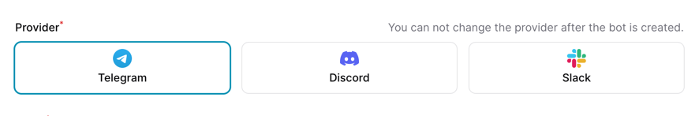

# Filament Radio card Input

This is a custom input for Filament form, instead of boring Radio buttons, you can display them with icons.

## Installation

```bash
composer require bangnokia/filament-radio-card
```



## Usage

Example you have an enum class like, which implemented `HasIcon` trait from Filament

```php
use Filament\Support\Contracts\HasColor;
use Filament\Support\Contracts\HasIcon;
use Filament\Support\Contracts\HasLabel;

enum BotProvider: string implements HasLabel, HasIcon
{
    case Telegram = 'telegram';
    case Discord =  'discord';
    case Slack = 'slack';

    public function getLabel(): ?string
    {
        return $this->name;
    }

    public function getIcon(): ?string
    {
        return match ($this) {
            self::Telegram => 'icon-telegram',
            self::Discord => 'icon-discord',
            self::Slack => 'icon-slack',
        };
    }
}
```

Then you can use it in your form like this

```php
RadioCard::make('provider')
    ->options(BotProvider::class)
    ->default(BotProvider::Telegram)
    ->columns(count(BotProvider::cases()))
```